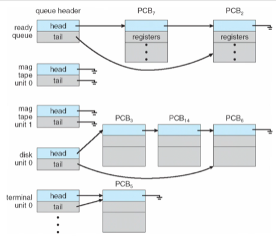
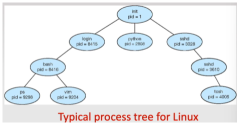

# Intro to OS

What is an operating system – no universal definition, but generally software acting as intermediary between user and hardware.

The main OS responsibility ius to allocate resources to use processes and control their execution. E.g. control access to memory when it is used by multiple processes.

Services of an operating system can be split to 2 categories: useful to user (run programs, io operations, file system management) and useful to the system (resource allocation, security)  

**Program execution stages:** load program into memory, execute program, stop program.

**I/O operations:** write something to file, take input from keyboard/mouse/peripherals. User processes don’t control devices directly - instead, the OS controls them and allows multiple processes to access the same IO devices.  

**File system management:** allows programs to read/write files and other complex actions, subject to permission management.  

**Communications between processes:** OS allows such communications between processes on the same computer or through a network. The main ways to do this are sharing memory or direct messages.

**Error handling:** caused by hardware failure, IO devices or bad software. The OS handles the error to prevent a full system crash and generally stops the process that created the error. Sometimes the OS cannot prevent a full system crash if the error occurs in a critical process.

**Resource allocation:** scheduling CPU time and other hardware resources to different processes to allow multiple processes to run concurrently. Considers type of process, speed of hardware, number of jobs to be executed etc.

**Accounting:** keeps track of which processes are running and the amount of resources used, useful for system admin for billing purposes or to find misbehaving processes.

**Security:** concurrent processes cannot interfere with each other or the OS itself (purposefully or otherwise), and must keep the system secure - process's shouldn't be able to access other process's memory space unless authorised.

**Kernel**: the core of an OS, loaded into memory at startup and always running – provides necessary services like memory management, process scheduling, file handling.  

**Kernel space**: part of memory which stores kernel, kept separate from user space where user processes are. The split is to prevent user processes from interfering with the kernel for both security and stability. User processes can access kernel space through system calls that require permissions, giving limited access if required and the user process is trusted.

**System calls:** an interface where the user processes can request services (privileged operations/instructions) from the kernel. System calls provide access the low-level functions done only by the OS, e.g. hardware resource management, file operations, IO device access, etc, and can be limited to only authorised processes to increase security.

**Dual mode operation:** the hardware operates in kernel mode or user mode depending on if the operations are requested by the OS or user processes. Privileged instructions are only executable in kernel mode as they could be abused by malicious user processes. System calls change the mode to 0/kernel, and the return from a call changes it to 1/user.

# OS structure

OS structure is large and complex.

**Early OS:** simple structures with not well defined levels, e.g. several layers could access IO devices. Hardware didn’t support dual mode operation.

**Early UNIX:** huge amount of functionality built into the single kernel layer. Very little overhead in system calls, but hard to maintain and modify due to interdependencies. These monolithic structures have elements that have carried over into modern OS.

**Layered approach:** each layer interacts with the layers above and below, capped by the hardware and user processes. Layer K uses the services of layer K-1 and provides services to layer K+1. Modular design allows for easy layer modification, as the services they require and need to provide are already specified, so can easily modify the implementation without changing functionality. However, layer definition can be difficult – it must be ensured that layer K+1 doesn’t require services from layers below K-1. Also, more kernel layers mean more system calls between layers, increasing the overhead of services provided to the user.  

**Microkernels:** modular design of kernel, remove all non-essential services from kernel and implement them as user services, e.g.

**Advantages**:

- Easy to extend the kernel due to simplicity
- Security and reliability are better as there is less to go wrong in the kernel  

**Disadvantages:**

- Performance suffers as there is more user-kernel processes interaction, so more system call overhead

**Loadable kernel:** the most modern approach and used in Windows/Linux/MacOS. A micro-like kernel implements the core services while other complex kernel services are loaded and run as is required. Similar to layered as each module is specifically designed for one purpose, but any module can interact with any other, so easier to access other kernel services.

# Processes

**What is a process:** a program currently in execution (in memory). One application can create several processes.

**Process in memory:**

- Text – stores instructions
- Data – stores the global variables
- Heap – dynamically allocated memory
- Stack – stores local variables and function parameters e.g. return address of the function

**Process states:**

- New – process is being created
- Running – instructions from the process are being executed
- Waiting – the process is waiting for some event to occur
- Ready – the process is waiting to be assigned to a processor
- Terminated – process has finished execution

State change graph:

**Process Control Block (PCB):**

- OS maintains a PCB for each process – data structure tracking the process
- Keeps track of:
  - Process state – running, waiting, ready, etc
  - Program counter – location of next instruction in process
  - CPU registers – contents of the CPU registers for use in case of interruptions
  - CPU scheduling information – priorities, scheduling queue pointers
  - Memory management info – locating process in the memory
  - Accounting info – CPU time used, time since start
  - IO status – list of files/IO devices in use by process

### Switching between processes

**Process Scheduling:**

- To maximise CPU use, processes are switched from on/off as others wait
- Process scheduler selects among available processes for next execution on CPU
  - Job queue – set of all process in the new state (long term scheduler)
  - Ready queue – set of all processes in the ready state (short term scheduler)
  - Device queue – set of processes waiting for an IO device

**Queues:** contains a head and a tail pointing to the next process to be serviced and the last one to be, with each process also pointing to the next in the queue. Processes can be inserted in any point in the queue depending on the priority by starting at the head and inserting when the new process has greater priority than the next in the queue.

### Queuing diagram

## **Schedulers**

There are 2 main types of schedulers: short term and long term.

**Short term scheduler:**

- Selects the next process to be executed from the ready queue
- Invoked very frequently – at least once every 100ms
- Must be very fast – if it takes 10ms to decide a CPU burst on a process of 100ms, then 9% of CPU time is wasted

**Long term scheduler:**

- selects processes in the new state to be brought into memory and ready queue
- Infrequent – can take minutes between creating one process and the next
- Controls number of processes in memory – when stable the arrival rate = completion rate
- Processes can be IO bound (more time doing IO than computation – short CPU burst) or CPU bound (more time doing computation – long CPU burst) - the long term scheduler tries to get a good mix of these processes

Time-sharing systems like Linux/Windows don’t have a long term scheduler and dump all processes on the short term scheduler. Long term schedulers are only used in computational workstations or similar where maximising CPU usage is needed and fast response to user input isn't required.

## **Process creation**

All processes are created by other processes, except the kernel process which begins at startup (named 'init'). The *'child processes'* can create more processes – this forms a process tree, the root of which is the kernel.

Processes are identified using a process identifier - the *'PID'* (an integer in Linux systems).

**Resource (CPU, memory, file) sharing:**

- There are 3 options for resource sharing between parent and child processes
  - The parent and child can share all resources
  - The child can share a subset of the parents resources, e.g. CPU and not memory/file
  - The parent and child share no resources

**Execution options:**

- There are 2 options for how parents and child processes execute
  - Parent and child execute concurrently
  - Parents waits until children terminate

**Address space:**

- 2 options:
  - Child’s address space and program is duplicate of parents (heap and stack are copied, not shared)
  - Child loads a new program into address space (no similarities)

**fork():** C command to create child processes that is an exact copy of the parent (including data/heap/stack) and continues from the line after fork(). In the child process, fork() returns 0 and in the parent process fork() returns the PID of the child (always an integer above 0).

## **Process Termination**

Processes terminate automatically after their last instruction is complete. Processes can also be terminated using exit() (in C, or using return() in the main function), which returns a status value to parent – parent can catch this to determine the success of the child process. All resources held by a process are released after termination.

Between child process termination and parents receiving the exit code, the child is a *'zombie process'* - the resources have been released but the entry is still in the process table. Once the parent receives the exit status of the child, the entry is removed from the table and the child is fully terminated.

Parent processes can terminate the execution of child process using abort() (in C) call. This is used when child takes up too much resources, no longer required or similar.

### **What happens when parent exits before children exit?**

Children become *'orphan processes'*. In UNIX systems, the init process is assigned as the parent process. The init process periodically issues wait() (in C) to collect the exit status of zombie orphan children to release their PIDs and entries in process table. Some OS don't support orphan processes (or child process must be specified to continue even if the parent exits), in which case orphan processes are immediately executed and removed from the process table.

*'Cascading termination'* is when a parent process exits, causing their children to exit, causing their children's children to exit, etc.

## **Inter-process Communication**

Processes running concurrently may want to communicate with each other for various reasons.

- Sharing files
- Sharing data about the user activity in the process
- Etc

There are two methods:

### **Shared memory**

A region of memory shared by communicating processes is created. This shared memory is typically inside one of the processes' memory and other processes requests access to it. System calls are used to create the shared memory, but there is no further use of kernel - there is low overhead. However, significant effort by programmer is required to maintain synchronization – ensure processes don’t try to access the same address at the same time.

### **Message passing**

Messages are directly exchanged between the processes using a communication channel provided by the kernel, e.g. a buffer. Processes use system calls to read/write to the buffer. This simplifies job of programmer (as the OS programmer already wrote the hard bit) but has a larger overhead due to many system calls.

The required system calls are a minimum of send() and receive() to allow message passing, whose functions are pretty obvious.

Message passing has multiple implementations/options – direct/indirect, how send/receive is synchronised, buffer size, etc.

- Direct:
  - Processes name each other explicitly when sending messages by using PID or similar
  - Links are established automatically and is associated with only one pair of communicating processes
- Indirect:
  - Messages sent through ‘mailbox’ using mailbox ID
  - Processes can only communicate if they share a mailbox
  - A link is established if processes share a common mailbox
  - Links may be between many processes and pairs of processes may have several communication links

Synchronisation of system messages

- Non-blocking - messages are sent and read whenever
- Blocking – synchronous messaging where messages are only sent when they are expected and only attempted to be received when messages are known to be sent
- Blocking send – sender pauses processing until the message is confirmed to have been received
- Blocked receive – receiver pauses processing until a message is available to receive

Buffering – A communication link is the buffer where messages are stored after being sent and before being read.

- Zero capacity – the queue has length 0, so sender waits until recipient receives the message
- Bounded capacity – the queue has finite length and once the end is reached, the sender must wait until the recipient reads a message from the buffer. This can take the form of a circular queue.
- Unbounded capacity – sender never waits after sending message

**Producer-consumer paradigm:** Shared buffer/memory is filled by a producer and emptied by a consumer - one process only sends messages and the other process only receives them. Consumer operates on the data passed to it by the producer, so waits if there are no messages. Similarly, if the buffer space is bounded then the producer must wait until a message is removed before adding.

## **Ordinary pipes**

Pipes provide a simple mechanism for one-way communication through message passing. The producer sends their output to the input of the pipe, which outputs to the input of the consumer. The consumer is typically a child process of the producer.

In C, the pipe() command creates a pipe by creating 2 temporary files and linking them:

")

X is set to 10 above

**Named pipes:** Exist outside of process run-time, in a directory as a file. These do not require a parent-child relationship that is typically needed in ordinary pipes, and once established many processes can use it for communication.
