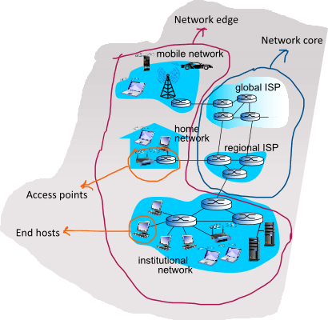
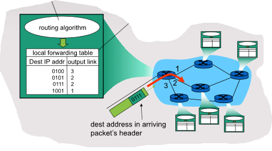

# Intro to Computer Networks

A computer network inter-connects a group of computing devices and allows processes running on different devices to communicate by sending messages which are forwarded by intermeiate nodes in the network.

## Computer Network Components

**General structure:**

### **End hosts:**

The edges of the network, consisting of personal devices and servers that run processes requiring communication over the network, e.g. web browsers, online games, email servers, etc.

These hosts **must** be able to: break down messages into '*packets*', add '*packet headers*' to them containing necessary information to travel through the network and send the packets over a communication link.

End hosts **could** (not required) also ensure reliable and orderly delivery of the packets depending on the transfer protocol used, and control the rate of transmission of packets.

### **Network Links:**

**Packet Switches:** intermediate devices that transfer data packets between nodes on the network, e.g. switches and routers.

**Communication Links:** Physical links between network devices, e.g. ethernet, fiber, wireless links, etc.

### **Access points:**

Nodes that directly connect the end hosts to the rest of the network, e.g. home routers, institutional routers, mobile data towers, etc. They are regulated and provided by '*Internet Service Providers*' (ISPs) which are hierarchical from regional (BT, Sky, etc) to global ISPs that interconnect regional ISPs.

## **Packet Transmission**

**Routing:**

Run routing algorithms to construct routing tables - a mapping of destination IP addresses to the next destination to send packets. This is done by packet switches and changes based on network usage so not all packets sent to the same destination take the same route.

**Forwarding:**

Once a packet arrives it is forwarded to the appropriate output according to the routing table.

**store-and-forward:** The entire packet must arrive at a node before it can be transmitted to the next node. Therefore the end-to-end delay of a node from beginning of reception to end of forwarding is 2L/R where L is the amount of bits in the packet and R is the link speed in bps. A large L means that the delay is long, so unsuitable for real-time applications like remote control of machine.

### **Delays**

**Queueing delay & loss:** If the arrival rate to a node is greater than the output transmission rate then packets enter a buffer to be sent in the node. Packets are dropped (lost) if the memory buffer fills up, and this is quite common.

**Delay Types:**

- **transmission delay: dtrans**
  - L: packet length (bits)
  - R: link bandwidth (bps)
  - Dtrans = L/R
- **queueing delay: dqueue**
  - time waiting in buffer to be sent
  - dependant on congestion level of node
- **nodal processing: dproc**
  - check for bit errors
  - determining the correct output link
  - typically very small, < 1ms
- **propagation delay: dprop**
  - d: length of physical link
  - s: propagation speed in link (typically 2x108 ms-1)
  - dprop = d/s
- **total delay: dnodal**
  - sum of above delays

### **Throughput**

The rate at which bits are transferred between a specific communicating pair of nodes.

*Instantaneous:* rate at a given point in time (average over a very small period).

*average:* rate over a longer period or entire duration of communication.
